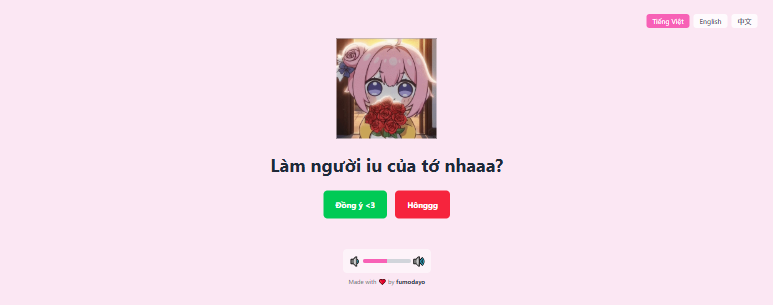

# Will You Be My Valentine? - An Interactive Confession App 💖

Tired of boring text messages? This project provides a fun, interactive, and unforgettable way to confess your feelings to someone special. It's a "can't-say-no" proposal page built with modern web technologies, featuring cute GIFs, playful interactions, and multi-language support.



---

## ✨ Features

- **Interactive "No" Button**: The "No" button playfully dodges the user's cursor and changes its text, making refusal a fun challenge.
- **Dynamic "Yes" Button**: As the user hesitates, the "Yes" button grows bigger, making it more and more inviting.
- **Multi-language Support (i18n)**: Fully functional in English (`/en`), Vietnamese (`/vi`), and Chinese (`/zh`), with automatic language detection based on the user's browser settings.
- **Background Music & Volume Control**: Features romantic background music with an elegant, on-screen volume controller.
- **Fully Responsive**: Looks great on all devices, from mobile phones and tablets to desktops.
- **Highly Customizable**: Easily change the text, GIFs, and music to make it truly your own.
- **Cute & Modern UI**: Built with a beautiful gradient background, soft fonts, and frosted glass effects.

## 🚀 Tech Stack

- **[Next.js](https://nextjs.org/)** - React Framework for the Web
- **[React](https://reactjs.org/)** - JavaScript library for building user interfaces
- **[Tailwind CSS](https://tailwindcss.com/)** - A utility-first CSS framework
- **[TypeScript](https://www.typescriptlang.org/)** - Strongly typed programming language that builds on JavaScript

## 🛠️ Getting Started

Follow these steps to get a local copy up and running.

### Prerequisites

- [Node.js](https://nodejs.org/en/) (v18 or later is recommended)
- [npm](https://www.npmjs.com/) or [yarn](https://yarnpkg.com/)

### Installation

1.  **Clone the repository:**

    ```sh
    git clone https://github.com/fumodayo/doro.git
    ```

2.  **Navigate to the project directory:**

    ```sh
    cd your-repo-name
    ```

3.  **Install dependencies:**

    ```sh
    npm install
    ```

    _or if you use yarn:_

    ```sh
    yarn install
    ```

4.  **Run the development server:**

    ```sh
    npm run dev
    ```

    _or_

    ```sh
    yarn dev
    ```

5.  Open [http://localhost:3000](http://localhost:3000) in your browser to see the result.

## 🎨 Configuration & Customization

Making this page your own is easy! All customizations are done in the `src/lib/` and `public/` directories.

### 1. Changing Text, GIFs, and Phrases

All text content and image paths are stored in one central file:

➡️ **File to edit:** `src/lib/translations.ts`

Inside this file, you'll find an object with keys for each language (`en`, `vi`, `zh`). You can edit the following fields for each language:

- `question`: The main question being asked.
- `yesButton`: The text on the "Yes" button.
- `noButton`: The initial text on the "No" button.
- `yesConfirmation`: The celebratory message after "Yes" is clicked.
- `noPhrases`: An array of strings that appear on the "No" button as the user interacts with it.
- `images`: An array of image/GIF paths to be displayed.
- `yesImage`: The final image/GIF shown after success.

**Important:**

- Place your new images/GIFs inside the `public/images/` directory.
- The number of items in the `noPhrases` array **must match** the number of items in the `images` array for the animations to sync up correctly.

### 2. Changing the Background Music

1.  Place your MP3 file in the `public/audio/` directory.
2.  Open the main page component: `src/app/[lang]/valentine-client-page.tsx`.
3.  Find this line (around line 32):
    ```javascript
    const audio = new Audio("/audio/doro.mp3");
    ```
4.  Change `/audio/doro.mp3` to the path of your new music file.

## 📜 License

Distributed under the MIT License. See `LICENSE` for more information.

## 🙏 Acknowledgments

- This project was inspired by various cute confession websites and memes.
- Character GIFs feature Doro from the game _Goddess of Victory: NIKKE_.

---

Made with ❤️ by [fumodayo](https://github.com/fumodayo)
